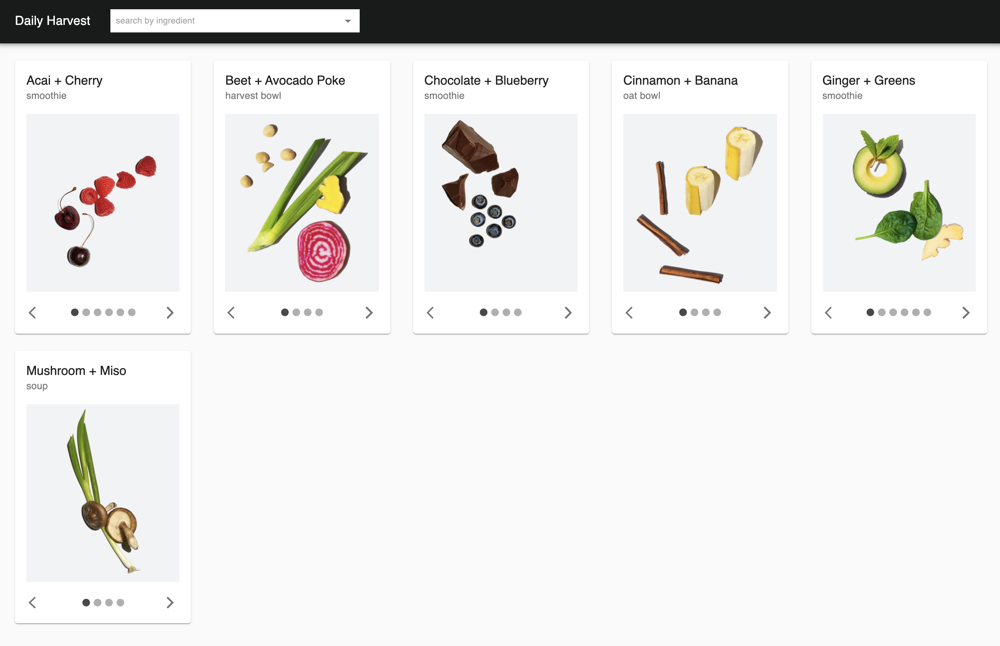
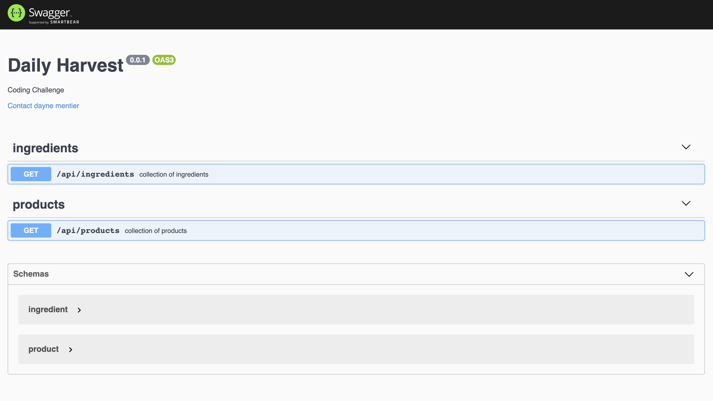

# Daily Harvest

## Getting Started

1. ```npm i``` - install the dependencies and run the build
2. ```npm start``` - start the client & server incremental dev builds
3. visit [http://localhost:8080](http://localhost:8080) to access the web application
4. visit [http://localhost:8081/api/docs](http://localhost:8081/api/docs)
 for the swagger docs

## Commands

| command              | description                                            |
|----------------------|--------------------------------------------------------|
| npm start            | start the server and client incremental dev builds     |
| npm test             | executes api & integration tests                       |
| npm run build        | compiles client and server source code                 |
| npm run build:client | compiles src/client to dist/client                     |
| npm run build:server | compiles src/server to dist/server                     |
| npm run start:client | start the client incremental dev build                 |
| npm run start:server | start the server incremental dev build                 |

## App

[http://localhost:8080](http://localhost:8080)



## Swagger Docs

[http://localhost:8081/api/docs](http://localhost:8081/api/docs)



## Coverage

</img>
